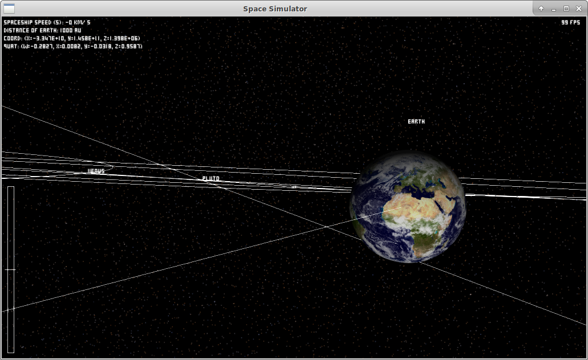

# Space-Explorer

This is an unfinisehd project I have been working on in my spare time just for the fun to discover C++, OpenGL, sharers and a bit of have some fun with maths.

The main idea is to be able to navigate within the known-universe and respect the differents sizes of everything.

Best played with a joystick or gamepad.

Please do not hesitate to fork and contribute to it.

## Pictures

Works well on all screens.

### Earth



### Saturn with its rings


### Solar System


### Milky Way


### Virgo Super-Cluster


## Contribute

This project relies on a few dependencies.

```bash
sudo apt install cmake libsdl1.2-dev libftgl-dev libglew-dev libopenal-dev libsndfile1-dev rapidjson-dev libtiff5-dev
```

Build and run:

```bash
./build.sh

cd bin
./space-explorer
```

## Missing Galaxy Virgo Catalog

Due to its size (compressed is 1.1Gb) I have to find the best way to share it.

Original file name was: croton_etal.BVRIK.ascii

## Fun facts

- To avoid the flickering, don't move the camera, move the universe around the camera
- Quaternions are super useful
